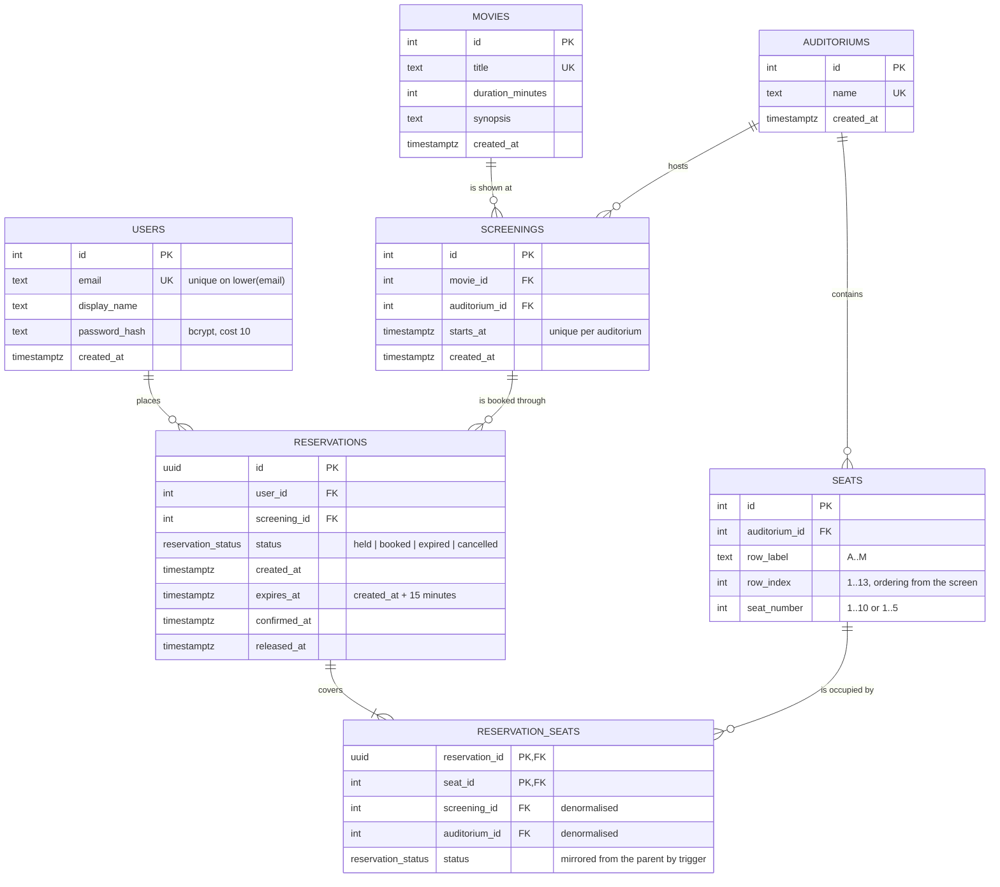

# Entity Relationship Diagram

Postgres 17. The authoritative definition is [`apps/api/db/migrations/001_init.sql`](../apps/api/db/migrations/001_init.sql);
this document explains the reasoning behind it.



## Why the model looks like this

### Seat status is derived, never stored

`Available` / `Reserved` / `Booked` is not a column. A seat is **Booked** when a
`reservation_seats` row points at a `booked` reservation, **Reserved** when it points at a
`held` reservation whose `expires_at` is still in the future, and **Available** otherwise.

That single decision does most of the work in this system:

- **`seats` stays immutable reference data.** Nothing mutates the hall while people book.
- **Expiry needs no job to be correct.** The read query filters on `expires_at > now()`, so a
  lapsed hold stops occupying its seat the instant it lapses. The background sweeper
  (`jobs/expirySweeper.ts`) exists only to clear dead rows out of the unique index below —
  if it stopped running, users would still see the right thing.
- **There is one source of truth.** A stored status column would need to be kept in step with
  the reservations that caused it, and would eventually drift.

### `reservation_seats` is denormalised on purpose

The child table repeats `screening_id`, `auditorium_id` and `status` from its parents. Each
repeat buys a constraint that could not otherwise exist:

| Column                    | What it makes possible                                                                                                                 |
| ------------------------- | -------------------------------------------------------------------------------------------------------------------------------------- |
| `screening_id` + `status` | The partial unique index that makes double booking impossible (below).                                                                 |
| `auditorium_id`           | Composite FKs proving the seat and the screening are in the _same_ hall.                                                               |
| `status`                  | Lets that index see reservation state without a join. Kept in step by an `AFTER UPDATE` trigger on `reservations`, so it cannot drift. |

### The double-booking guard is an index, not application code

```sql
CREATE UNIQUE INDEX reservation_seats_one_active_occupant
    ON reservation_seats (screening_id, seat_id)
    WHERE status IN ('held', 'booked');
```

At most one row per `(screening, seat)` may be in an occupying state. Two concurrent
transactions inserting the same seat collide here: one commits, the other receives SQLSTATE
`23505`, which the API translates into `409 SEAT_UNAVAILABLE`. Correctness does not depend on
the API being the only writer, on it being a single process, or on anyone remembering to take
a lock.

Statuses `expired` and `cancelled` fall out of the index, which is what returns the seat to
sale.

### Composite foreign keys

`seats (id, auditorium_id)` and `screenings (id, auditorium_id)` carry redundant unique
constraints so `reservation_seats` can reference both. The effect is that booking "seat A3 of
Hall 2" for a screening running in Hall 1 is rejected by the database, not merely by a
service-layer check.

### Reservation identifiers are UUIDs

Reservation ids travel in URLs and are the one identifier an authenticated user could try to
guess. Sequential integers would leak volume and invite enumeration; everything else stays
`INTEGER GENERATED ALWAYS AS IDENTITY`, which is cheaper to index and to move over the wire.

## Indexes

| Index                                   | Purpose                                                          |
| --------------------------------------- | ---------------------------------------------------------------- |
| `users_email_lower_key`                 | Case-insensitive unique email without needing `citext`.          |
| `seats_auditorium_row_idx`              | Drives the seat-map read in row/seat order.                      |
| `screenings_starts_at_idx`              | Ordering the showtimes list.                                     |
| `reservations_user_idx`                 | "My reservations", newest first.                                 |
| `reservations_active_holds_idx`         | Partial on `status = 'held'`: the sweeper scans only live holds. |
| `reservation_seats_one_active_occupant` | The double-booking guard.                                        |
| `reservation_seats_seat_idx`            | Seat-map lookups by `(screening, seat)`.                         |

## Lifecycle of `reservation_status`

```
                  ┌──────────► booked ◄── confirm within 15 minutes
   create hold ──►│ held
                  ├──────────► expired    ◄── expires_at passed
                  └──────────► cancelled  ◄── released by the user
```

`held` and `booked` occupy a seat. `expired` and `cancelled` do not, and are kept rather than
deleted so the history of a seat remains auditable.
